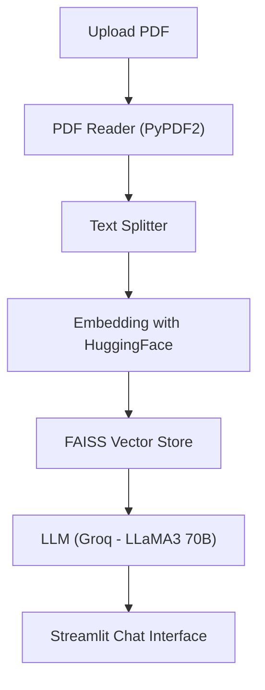

# 📄 GenAI PDF Chatbot using Groq & LangChain

This project is a **GenAI-powered chatbot** that allows users to **upload PDFs and ask questions** about the content in natural language. It uses **HuggingFace embeddings** for semantic understanding and **Groq’s ultra-fast `llama3-70b-8192` model** for high-quality responses — all powered through **LangChain** and displayed with **Streamlit**.

---

## 🚀 Features

- 📄 Upload and process PDFs
- 🧠 Ask deep, contextual questions
- 💬 Memory-enabled chat flow using LangChain
- ⚡ Super-fast responses via **Groq's LLaMA 3 (70B)**
- 🧩 Semantic search using HuggingFace + FAISS
- 🖥️ Simple and clean UI with Streamlit

---

## 🧠 Tech Stack

| Component              | Technology                                   |
|------------------------|-----------------------------------------------|
| UI                     | Streamlit                                     |
| LLM                    | Groq (`llama3-70b-8192`) via LangChain        |
| Embeddings             | Hugging Face (`all-MiniLM-L6-v2`)             |
| Vector Store           | FAISS                                          |
| PDF Parser             | PyPDF2                                         |
| LangChain Components   | Retriever, Memory, Conversational Chain       |
| Environment Variables  | Python-dotenv (`.env` file)                   |

---

## 📈 System Architecture


---
👩‍💻**Author**
---
---
```Sushma Kothamasu```
---

